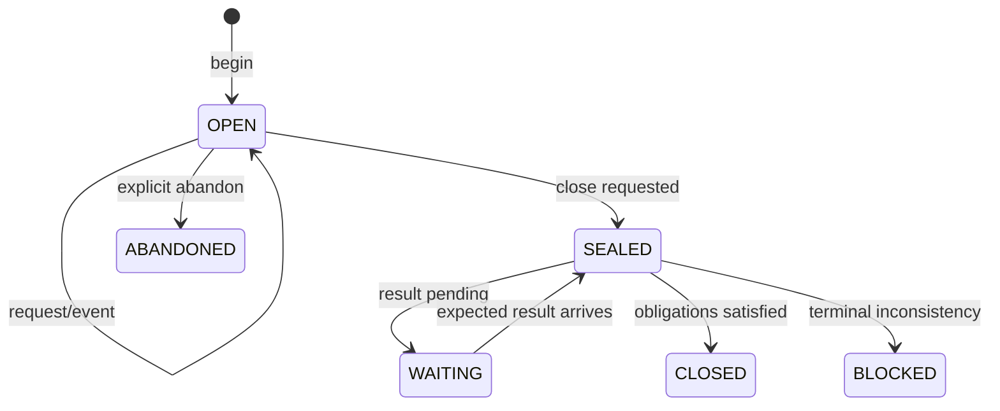
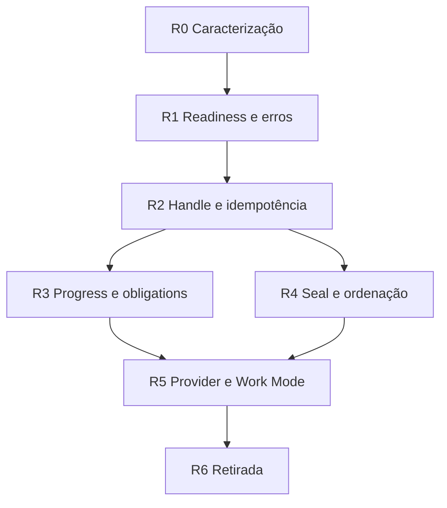

# Agent Cycle e paved path — plano de refatoração v0.1

Status: **planejamento não autoritativo; primeira iteração da biópsia**  
Baseline observado: `main@158d40b0a6c30035ba6dfa4b24b2566328eee10e`  
Escopo: Agent Cycle, Agent Tools, carriers hospedados, fechamento, observabilidade,
integração com Work/Work Mode e ordenação assíncrona.

Este documento não altera ProjectState, não cria assignment, não promove
capability e não autoriza mutação. O próximo passo operacional continua sendo
descoberto em `ops/state/project.json`; na baseline acima ele é D3. A intenção
aqui é preparar uma refatoração incremental, preservando os invariantes que já
foram provados e substituindo mecanismos apenas quando a alternativa for
demonstravelmente superior.

## 1. Resultado pretendido

O paved path deve permitir que um agente declare poucos fatos de alto nível e
receba uma continuação inequívoca:

```text
begin(work?, role, intent)
-> execute(operation)
-> status
-> close | waiting | blocked
```

Detalhes mecânicos — providers, heads, hashes, IDs de comentários, artefatos,
readbacks e obrigações de lifecycle — devem ser derivados e carregados por um
handle validado sempre que já forem observáveis. O agente não deve reconstruir
manualmente uma sessão equivalente nem escolher um caminho ad hoc só porque um
carrier concreto está visível.

O resultado não é uma nova authority de sessão. É uma composição mais simples
das authorities, writers e evidências existentes.

## 2. Não objetivos

- corrigir os defeitos nesta etapa de planejamento;
- reescrever o control plane de uma vez;
- enfraquecer `UNKNOWN != PASS`, CAS, leases, plan/apply/readback ou escopo;
- transformar comentários de issue, artifacts ou o cycle handle em authority;
- fazer Agent Cycle escrever silenciosamente ProjectState, Work ou Coordination;
- unificar domínios que possuem writers e lifecycles distintos;
- redesenhar aqui o uso produtivo do tempo de espera assíncrona; a ideia fica
  registrada no apêndice, fora do plano de execução atual.

## 3. Invariantes a preservar

| Intenção existente | Preservação durante a refatoração | Prova mínima |
|---|---|---|
| Um fato mutável tem uma authority e writer canônico | O kernel apenas projeta e delega; nunca se torna writer | testes negativos de authority e escopo |
| `observe -> plan -> validate -> apply -> readback` | Cada operação mantém as cinco fases, ainda que escondidas pelo handle | receipt ligado ao plano e ao readback |
| `UNKNOWN != PASS` | Readiness e resultados continuam trivalorados | matrizes de provider incompleto, timeout e ambiguidade pós-write |
| Descoberta não autoriza | Resolver provider/tool não concede mutação | decisão de policy separada da resolução |
| Work, lease, branch e PR têm lifecycles diferentes | O ciclo correlaciona sem fundir autoridades | obrigações independentes e disposições explícitas |
| Close observa, não corrige | Close calcula obrigações e estado; writers fazem qualquer reconciliação | testes que proíbem side effects no close |
| Provider é carrier, não authority | Adapters normalizam fatos com proveniência | fixtures equivalentes local/hosted/Work Mode |
| `main` nunca é alvo implícito | Todo target/ref permanece explícito | rejeição de default e divergência de head |
| História e evidência são recuperáveis | Compatibilidade só é retirada depois de migração e prova | inventário de consumidores e condição de morte |

## 4. Biópsia da baseline

### 4.1 O que já funciona e deve ser mantido

- O núcleo determinístico de `agent begin/close` existe e valida integridade de
  baseline, delta, evidência e receipt.
- O carrier hospedado conseguiu executar um ciclo real e uma mutação Git
  governada, com lease, readback e fechamento válidos.
- Agent Tools separa request, resolução, admissão, dispatch e resultado.
- Domain writers continuam separados; Agent Cycle não absorveu ProjectState,
  Work ou Coordination.
- `cycleInstanceId` já resolve parte da colisão entre execuções hospedadas com o
  mesmo contexto determinístico.
- As falhas recentes de implementação foram detectadas e corrigidas por PRs
  pequenas, o que favorece uma estratégia incremental.

### 4.2 Pontas soltas observadas

| Área | Estado atual | Causa estrutural provável | Consequência |
|---|---|---|---|
| Readiness | Um begin de `governed-mutation` pode ficar `READY` com mutações remotas `UNKNOWN` | Status do contexto, da intenção e da tool são colapsados | O agente interpreta contexto íntegro como execução pronta |
| Baseline de refs | Em uma inspeção local, `inspection=158d40b` coexistiu com `control=19d5094` | `local` observa a ref local de `main`, não necessariamente `origin/main` | O contexto é válido como fotografia local, mas pouco natural para planejar trabalho remoto |
| Identidade | `cycleId` deriva da baseline; o hosted adiciona `cycleInstanceId` | Duas necessidades foram acrescentadas em momentos distintos | Correlação e idempotência não são uniformes entre artifacts e results |
| Begin | Role, intent e scope são grossos | Não há binding explícito a Work, objetivo, recursos e critério de saída | Branch auxiliar e branch de Work podem divergir sem relação formal |
| Close | `closeRequirements` é uma lista estática | Obrigações não são derivadas dos eventos realmente ocorridos | Um close pode passar sem dispor branch/Work/PR que nasceram no ciclo |
| Delta | Só ProjectState e quatro `sourceHeads` entram no durable delta | Baseline foi desenhada antes de operações arbitrárias em refs/paths | Mudança fora desse conjunto depende de evidence declarada e pode escapar da detecção |
| Trace assíncrono | A janela termina no comentário de close | Comentários são usados ao mesmo tempo como transporte e limite temporal | Resultado de request pré-close que chega pós-close nunca entra naquela janela |
| Estabilização | Três observações com espera de um segundo | Polling curto tenta compensar consistência/latência | Não representa trabalho assíncrono real e produz BLOCKED prematuro |
| Concorrência | Tool e lease serializam por issue em grupos diferentes; Cycle não possui grupo equivalente | A unidade de concorrência é o workflow, não o ciclo/recurso | Acquire, mutate, release e close podem ultrapassar uns aos outros |
| Work | Scheduler seleciona Work, mas tools não carregam binding forte ao item | Cycle e Work foram compostos por convenção | Close não exige advance/wait/handoff/done ou continuação explícita |
| Provider | Runtime observations são overlays fornecidos manualmente | Core provider-neutral não ganhou um adapter de ambiente completo | Work Mode enxerga capabilities que o CLI local classifica como não observadas |
| Falha de begin | Resultado resumido pode perder blockers internos; artifacts de falha não são equivalentes aos de sucesso | Happy path domina a materialização hospedada | Diagnóstico exige reconstrução por logs e comentários |
| Observabilidade | Issue, runs, artifacts, receipts, lifecycle e refs precisam ser unidos manualmente | Não existe uma projeção de progresso única e read-only | O caminho operacional é difícil de explicar e auditar ao vivo |
| Escala do bus | A coleta pode paginar/reler muitos comentários e reconstruir toda a janela | Issue é log de transporte sem cursor por ciclo | Custo e ambiguidade crescem com a história do bus |
| Lifecycle de branch | Branch Hygiene exige evidência forte, mas o close não produz disposição terminal suficiente | Contratos de criação, integração e cleanup não formam uma cadeia completa | Branches de qualificação permanecem em `review` apesar do ciclo concluído |
| Proteção histórica | Restrições humanas podem não estar codificadas em ProjectState/policy | Autorização da conversa e policy durável estão separadas | Um planner futuro pode não conhecer uma branch que nunca deve ser apagada |

### 4.3 Concentração e acoplamento

Na baseline, um recorte do núcleo e carriers soma 4.231 linhas distribuídas entre
dez módulos Python e três workflows. O número não é meta de redução isolada,
mas indica que uma operação atravessa muitas fronteiras:

```text
command envelope
-> workflow carrier
-> hosted binding
-> trace collection
-> tool/lease dispatch
-> domain writer
-> result comment/artifact
-> close stabilization
-> delta/evidence/receipt
```

Há valor nessas fases, mas parte da complexidade atual vem do transporte:
identidade, paginação, janela, estabilização e correlação aparecem em mais de
uma camada. A refatoração deve remover repetição mecânica sem colapsar os guards.

## 5. Modelo alvo

### 5.1 Quatro conceitos públicos

1. **CycleHandle**: identidade opaca, imutável e validada. Carrega referências
   necessárias, mas não concede authority.
2. **OperationIntent**: operação de alto nível ligada a Work/objetivo/recursos e
   a um critério de término ou handoff.
3. **CycleProgress**: projeção read-only dos eventos, recursos tocados,
   pendências, leases e obrigações.
4. **CycleClosure**: resultado terminal `PASS`, `WAITING`, `BLOCKED` ou
   `UNKNOWN`, com razões estruturadas e próxima ação canônica.

Uma API conceitual mínima:

```text
cycle.begin(repository, role, intent, workId?) -> CycleHandle + readiness
cycle.execute(handle, operation)               -> PASS | PENDING | BLOCKED | UNKNOWN
cycle.status(handle)                           -> CycleProgress
cycle.close(handle)                            -> PASS | WAITING | BLOCKED | UNKNOWN
cycle.abandon(handle, disposition)             -> terminal receipt
```

`PENDING` descreve uma operação aceita cuja evidência terminal ainda não chegou.
`WAITING` descreve um ciclo coerente que ainda possui pendências assíncronas.
Nenhum deles equivale a `PASS`.

### 5.2 Readiness separada

O begin deve projetar dimensões distintas:

| Dimensão | Pergunta |
|---|---|
| `contextStatus` | As authorities e contratos necessários foram lidos de forma íntegra? |
| `intentReadiness` | A intenção declarada possui escopo, Work/objetivo e precondições suficientes? |
| `toolReadiness` | Existe ao menos uma ToolSurface completa para a operação pretendida? |
| `providerResolution` | Qual provider satisfaz integralmente os invariantes e com que proveniência? |
| `mutationAuthorization` | A policy/role/ownership autoriza esta operação exata? |

O status agregado só deve orientar a próxima ação; não deve apagar essas
dimensões. Um contexto pode ser íntegro e, ao mesmo tempo, não estar pronto para
mutação.

### 5.3 Obrigações derivadas

As obrigações de close devem nascer de fatos observados, não de uma checklist
fixa:

| Evento/fato | Obrigação gerada |
|---|---|
| lease adquirido | release verificado ou handoff explícito permitido pela policy |
| branch criada ou alterada | integrar, arquivar, reter com prazo/owner ou abandonar com disposição |
| PR criada | CI terminal + merge/close/handoff, conforme objetivo |
| Work selecionado | advance, wait, handoff, done ou continue explícito |
| ProjectState milestone comprovado | transition pelo writer ou `NO_CHANGE` justificado |
| operação aceita e não terminal | `WAITING` com evento esperado, nunca PASS |
| target fora do escopo declarado | extensão de escopo validada ou BLOCKED |

O projection engine pode calcular obrigações; somente writers canônicos podem
satisfazer as que exigem mutação.

### 5.4 Recursos tocados

Cada plan/dispatch deve declarar um `TouchedResourceSet` derivável:

- refs e heads esperados;
- paths/blobs;
- PRs e checks esperados;
- authorities e revisions;
- Work item;
- lease/binding;
- ProjectState quando aplicável.

Begin captura baseline apenas para recursos conhecidos. Novos recursos entram
no conjunto ao serem planejados, antes do apply. Close reobserva o conjunto e
rejeita deltas sem atribuição. Um hash do inventário de refs pode ser usado como
sentinela de drift, sem transformar o inventário em authority.

### 5.5 Seal assíncrono

Close deve selar o conjunto de requests, não encerrar a janela de resultados:



Regras:

- requests novos são rejeitados depois do seal;
- resultados correlacionados a requests pré-seal continuam elegíveis;
- a mesma tentativa de close é retomável e idempotente;
- timeout vira evidência estruturada e policy de retry, não loop de polling;
- um resultado tardio não pode contaminar outro `cycleInstanceId`.

### 5.6 Ordenação e colisões

A unidade de ordenação deve ser o ciclo **e** o recurso mutável, não o nome do
workflow. Cada command recebe sequência monotônica e dependências explícitas:

```text
seq 1 acquire(branch X)
seq 2 mutate(branch X) dependsOn 1
seq 3 release(branch X) dependsOn 2
seq 4 seal/close       dependsOn 3
```

O dispatcher admite paralelismo apenas quando os recursos são disjuntos ou a
operação é declaradamente read-only/commutative. Lease e CAS permanecem como
guards de autoridade e concorrência; a sequência reduz ultrapassagens no
transporte, mas não substitui esses guards.

### 5.7 Adapter de Work Mode

O core permanece provider-neutral. Um adapter de ambiente deve:

1. observar features e scopes reais dos connectors disponíveis;
2. materializar `RuntimeProviderObservations` e `RuntimeObservationBundle` com
   proveniência, validade e instante de observação;
3. resolver local, hosted ou connector sem pedir ao agente para copiar heads e
   IDs que o adapter já conhece;
4. executar readback independente;
5. expor `PENDING/WAITING` quando a operação é assíncrona;
6. retornar um CycleHandle estável para retomada por outra chamada/runtime.

Compatibilidade com Work Mode não significa ensinar o repositório sobre um MCP
específico. Significa fornecer uma boundary pequena que traduza capabilities do
ambiente para os contratos provider-neutral já existentes.

### 5.8 Projeção de observabilidade

`CycleProgress` deve responder, em uma leitura:

- identidade do ciclo e baseline;
- Work/objetivo e branch principal/auxiliares;
- status e última transição;
- requests pendentes e evento esperado;
- leases ativos;
- recursos tocados e readbacks;
- obrigações abertas;
- PR/CI esperado e observado;
- elegibilidade de close;
- blocker, retryability e próxima ação canônica;
- artifacts e expiração.

Ela é derivada de evidence imutável e authorities observadas. Pode ter cache
descartável por performance, mas cache nunca vira authority. Leituras devem ser
incrementais por cursor/cycle instance, evitando reprocessar toda a issue.

Falhas de begin e close devem produzir o mesmo envelope observável do happy
path, contendo pelo menos fase, blocker original, heads relevantes,
retryability, ação esperada, run e artifact quando existentes.

## 6. Fronteiras internas propostas

| Componente | Responsabilidade | Não deve fazer |
|---|---|---|
| `cycle_kernel` | estado, transições, identidade, obligations e validações puras | I/O, GitHub ou sleep |
| `cycle_projection` | progress, touched resources, delta e close eligibility | autorizar ou escrever |
| `provider_adapter` | observação de features/scopes e transporte | decidir policy semântica |
| `operation_dispatch` | sequência, dependências, idempotência e correlação | substituir lease/CAS |
| `domain_writer` | mutação canônica e readback do domínio | gerir sessão/ciclo |
| `cycle_store` lógico | recuperar events/artifacts por cycle instance | tornar-se nova authority |

`cycle_store` é um papel lógico, não necessariamente um novo serviço ou arquivo.
No primeiro recorte ele pode continuar usando issue comments e artifacts, desde
que a API de leitura esconda paginação, cursor e correlação. Só criar storage
novo se medições demonstrarem necessidade e houver owner/lifecycle/death
condition explícitos.

## 7. Alternativas avaliadas

### A. Refatoração incremental por caracterização — recomendada

Extrair contratos puros, adicionar projeções e migrar carriers em fatias. Mantém
o sistema operável e permite provar equivalência a cada PR. Custa convivência
temporária entre versões, que precisa de condição de morte rigorosa.

### B. Reescrever Agent Cycle como uma state machine central

Produziria uma superfície conceitualmente limpa mais cedo, mas recriaria muitos
guards já provados e aumentaria o risco de nova authority acidental. Não é
recomendada enquanto os invariantes não estiverem cobertos por testes de
caracterização independentes da implementação.

### C. Ajustar somente workflows e polling

Pode reduzir falhas visíveis, mas mantém readiness, Work binding, durable delta
e obligations inconsistentes. Serve apenas para mitigação urgente, não como
arquitetura alvo.

### D. Fazer o agente orquestrar connectors diretamente

Parece curto no primeiro uso, porém repete o caminho ad hoc que originou a
ambiguidade. Provider discovery, correlação e readback devem ficar no adapter e
nos tools governados, não em prompts/conversa.

## 8. Plano de execução em fatias

Cada fatia deve caber em PR revisável, manter compatibilidade declarada e acabar
com gates verdes. Nenhuma fatia depende de terminar a refatoração inteira.

### R0 — Caracterização e mapa de consumidores

Objetivo: congelar intenção antes de mover código.

Entregas:

- fixtures golden de um ciclo local, hosted, falha de begin, post-write
  ambiguity, resultado tardio e duas instâncias simultâneas;
- matriz de status atuais, inclusive comportamentos estranhos que ainda são
  compatibilidade, não necessariamente desejados;
- grafo de imports, schemas, workflows e consumidores externos;
- inventário de campos montados manualmente pelo agente/transport;
- orçamento inicial de latência, chamadas, comentários lidos e artifacts.

Saída: nenhuma mudança de comportamento. Divergências encontradas viram casos
de decisão explícita, não correções oportunistas.

### R1 — Vocabulário de readiness e erro

Objetivo: eliminar o significado ambíguo de `READY` sem alterar writers.

Entregas:

- projeções separadas de context/intent/tool/provider/authorization;
- envelope comum de falha para begin, execute e close;
- `PENDING` e `WAITING` registrados semanticamente;
- compatibilidade de leitura dos artifacts anteriores.

Gate: nenhuma operação antes aceita passa a executar por uma condição mais
fraca; diferenças de status são justificadas por fixtures.

### R2 — Identidade, handle e idempotência

Objetivo: tornar retomada e correlação naturais.

Entregas:

- `cycleId` explicitamente definido como fingerprint de contexto;
- `cycleInstanceId` presente em todos os commands, artifacts, receipts e erros;
- CycleHandle versionado, opaco na interface pública e validável no core;
- replay fences para begin/execute/close;
- `abandon` terminal com disposição de Work/lease/branch exigida, não implícita;
- `expiresAt` e política de artifact expirado.

Gate: retries não duplicam mutação e instâncias concorrentes não se contaminam.

### R3 — Progress, recursos tocados e obrigações dinâmicas

Objetivo: tornar o close consequência do trabalho observado.

Entregas:

- `TouchedResourceSet` derivado de plan/dispatch;
- `CycleProgress` read-only e leitura incremental;
- obligation engine determinístico;
- binding opcional a Work no begin e obrigatório quando Scheduler/assignment
  selecionar um item;
- disposição explícita para branches auxiliares;
- close reportando `NO_CHANGE` apenas quando permitido e justificado.

Gate: todo durable delta tocado tem evidence atribuída; branch/Work/lease/PR
criados no ciclo não somem do fechamento.

### R4 — Seal e execução assíncrona ordenada

Objetivo: remover polling curto e ultrapassagens entre workflows.

Entregas:

- seal retomável;
- sequência/dependências por ciclo e recurso;
- status `WAITING` com evento esperado;
- correlação de resultados pós-seal;
- concurrency groups coerentes entre cycle/tool/lease/remote execution;
- testes de reorder, duplicate delivery, delayed result e timeout.

Gate: close nunca passa antes de resultado terminal obrigatório; entrega tardia
válida pode concluir a mesma instância sem novo begin.

### R5 — D3 / bridge de provider e Work Mode

Objetivo: tornar o caminho natural no ambiente real sem contaminar o core.

Entregas:

- interface única de provider observation;
- adapter Work Mode que materializa bundles automaticamente;
- seleção determinística de carrier por capability completa;
- readback independente e proveniência;
- fixtures de equivalência local, GitHub Actions e connector;
- diagnóstico claro de scopes ausentes, inclusive escrita de workflows.

Gate: o agente não precisa alegar “Git sem credencial” quando um provider
equivalente governado existe, nem tenta usar shell Git como fallback implícito.

### R6 — Consolidação e retirada

Objetivo: colher a simplificação, não apenas adicionar outra camada.

Entregas:

- hosted workflows reduzidos a carriers finos;
- validações duplicadas removidas depois da migração dos consumidores;
- versões antigas e campos transitórios com warnings, prazo e owner;
- documentação de recovery/break-glass;
- medição final contra a baseline R0.

Gate: cada compatibility path retirado tem zero consumidores observados,
evidência de equivalência e rollback documentado.

## 9. Ordem recomendada e dependências



D3 pode iniciar discovery em paralelo a R0, mas a implementação do adapter deve
consumir o vocabulário de readiness de R1. Isso evita cristalizar novamente a
ambiguidade atual dentro do bridge.

## 10. Estratégia de testes e prova

### Testes de caracterização

- begin local com `main` local atrás de `origin/main`;
- hosted begin com provider presente mas não sondado;
- begin BLOCKED preservando blocker raiz;
- mutação PASS com lease acquire/release;
- request pré-seal e result pós-seal;
- close com request pendente;
- branch auxiliar sem disposição;
- Work READY sem avanço, wait, handoff ou done;
- duas instâncias com a mesma baseline;
- dois ciclos tocando o mesmo recurso e recursos disjuntos;
- write acknowledged sem readback;
- artifact expirado e retomada impossível.

### Testes de propriedade/invariantes

- nenhuma projeção autoriza mutação;
- nenhuma mudança durable atribuída produz PASS sem evidence aceita;
- nenhuma delivery duplicada produz segundo apply;
- nenhum resultado de outra instância satisfaz obrigação;
- nenhuma ordem de entrega válida viola dependências;
- nenhum provider parcial satisfaz capability completa;
- nenhum close corrige authority por side effect.

### Prova ao vivo

Somente depois dos testes locais e hosted isolados:

1. ciclo read-only em Work Mode;
2. ciclo com branch efêmera e arquivo de qualificação;
3. resultado deliberadamente atrasado depois do seal;
4. dois ciclos concorrentes no mesmo recurso, esperando um único vencedor;
5. dois ciclos em recursos disjuntos, esperando progresso paralelo;
6. close com disposição terminal e Branch Hygiene confirmando cleanup;
7. readback final e retirada do artefato efêmero pelo writer normal.

## 11. Métricas de simplificação

As metas devem ser fechadas em R0, mas as seguintes direções são úteis:

| Métrica | Direção desejada |
|---|---|
| campos que o agente copia entre begin/tool/close | reduzir ao handle + intenção/operação |
| decisões manuais de provider | zero no happy path |
| polls ativos feitos pelo agente | zero; usar progress/evento esperado |
| releituras completas do Agent Bus | substituir por cursor/correlação incremental |
| lugares que validam identidade de ciclo | um kernel compartilhado por versão |
| branches auxiliares sem disposição após close PASS | zero |
| falhas sem blocker raiz/retryability | zero |
| compatibility paths sem owner/death condition | zero |
| comportamento divergente entre local/hosted/Work Mode | somente diferenças declaradas de capability |

Redução de linhas é consequência possível, não critério primário. Uma linha que
preserva um guard provado vale mais que uma abstração curta que esconda estado.

## 12. Migração, compatibilidade e rollback

- Adotar leitura nova antes de escrita nova sempre que possível.
- Emitir artifacts duplos apenas por janela curta e explicitamente versionada;
  comparar hashes/projeções antes do cutover.
- Manter carriers antigos acionáveis até o novo caminho passar fixtures e prova
  ao vivo, mas impedir que ambos escrevam a mesma operação.
- Usar feature admission por cycle version, não fallback silencioso.
- Rollback troca o carrier/adapter; não reverte receipts ou reescreve história.
- Toda versão transitória declara owner, consumidores, data/condição de retirada
  e como detectar uso residual.
- Mudanças em `main`, ProjectState, policies de proteção ou workflow scopes
  permanecem em PRs próprios e recebem revisão mais estrita.

## 13. Riscos

| Risco | Mitigação |
|---|---|
| Nova camada vira authority acidental | schemas `readOnly`, `semanticAuthority=false`, sem writer e testes negativos |
| Compatibilidade duplica ainda mais o sistema | janela curta, telemetria de consumidores e death condition por path |
| Seal cria ciclos eternos | expiry + abandon + disposition, sem converter timeout em PASS |
| Sequenciamento serializa tudo | conflito por recurso; reads/disjuntos podem ser commutative |
| Adapter Work Mode vaza detalhes de connector ao core | boundary provider-neutral + fixtures comuns |
| Obligation engine toma decisão de domínio | deriva obrigação; domain writer/policy decide e executa |
| TouchedResourceSet perde mutação ad hoc | admission exige registro pré-apply + sentinela de ref drift |
| Refatoração bloqueia D3 por muito tempo | discovery D3 paralelo; fatias R0/R1 pequenas e sem rewrite |
| Documento vira estado corrente paralelo | status não autoritativo e ausência deliberada de checkpoint futuro copiado |

## 14. Decisões que ainda precisam de evidência

1. Issue comments continuam adequados como event transport após leitura por
   cursor, ou artifacts/check-runs oferecem melhor correlação?
2. Qual é o menor CycleHandle que permite retomada sem expor detalhes frágeis?
3. A sequência monotônica deve ser por ciclo, por recurso, ou ambos com uma
   relation explícita?
4. Como modelar uma branch auxiliar de qualificação ligada a Work sem torná-la
   parte da authority de Work?
5. Quando `NO_CHANGE` é uma disposição válida para Work e ProjectState?
6. Que evento é confiável para despertar um close `WAITING` em cada carrier?
7. Quais restrictions humanas de branches precisam virar policy durável, e qual
   authority já existente deve possuí-las?
8. Qual é o retention mínimo para permitir retomada sem acumular artifacts?
9. Quais validações hoje duplicadas são defesa em profundidade deliberada e
   quais são repetição acidental?

Essas perguntas devem ser respondidas em R0/R1 com fixtures, profiling e revisão
de authority; não por preferência estética.

## 15. Primeiro recorte recomendado

O primeiro PR desta linha de refatoração, quando ela for admitida pela authority
operacional, deve ser **R0 apenas**. Isso não substitui automaticamente D3 nem a
transição corrente de ProjectState:

- nenhum schema operacional novo;
- nenhuma mudança de status;
- nenhuma alteração de workflow ou concurrency;
- fixtures e testes de caracterização dos casos já observados;
- mapa de consumidores e campos manuais;
- baseline de custo/latência;
- decisões de compatibilidade propostas para R1.

Esse recorte é pequeno, reversível e cria uma linha de base objetiva. Após R0,
R1 pode mudar o vocabulário de readiness sem misturar a mudança com transporte,
Work binding ou execução assíncrona.

Antes de qualquer mudança em Branch Hygiene ou na semântica de prune, a branch
histórica que deve ser preservada precisa estar representada em policy durável e
coberta por teste negativo. A restrição não deve depender apenas da memória do
agente ou da conversa.

## Apêndice A — registro de ideia fora do escopo

Durante esperas assíncronas, um agente poderia realizar trabalho útil,
read-only, seguro e não conflitante em vez de apenas consultar status. A ideia
fica registrada para investigação futura. Este plano não define scheduler,
seleção de tarefas, budgets nem critérios de segurança para esse comportamento.

## Apêndice B — fontes da biópsia

Fontes executáveis e contratuais observadas na baseline:

- `AGENTS.md`;
- `ops/state/project.json`;
- `ops/semantics/registry.json` e policies relacionadas;
- `docs/kickstarts/roles/manager-gitops.md`;
- `docs/architecture/agent-cycle-0.1.md`;
- `docs/architecture/agent-cycle-provider-gap-0.1.md`;
- `docs/plans/autonomous-evolution-roadmap-2026-08.md`;
- `tools/agent_cycle.py`;
- `tools/agent_cycle_close/`;
- `tools/hosted_agent_cycle.py`;
- `tools/hosted_agent_cycle_trace.py`;
- `tools/agent_tools/`;
- `tools/runtime_capabilities.py` e `tools/runtime_observations.py`;
- workflows hosted cycle/tool/write-lease e remote canonical execution;
- evidência ao vivo e histórico recente de PRs AT3A–AT3D.

Próxima revisão deste documento: após R0, ou antes se D3 provar uma restrição de
provider/Work Mode que invalide alguma boundary proposta.
